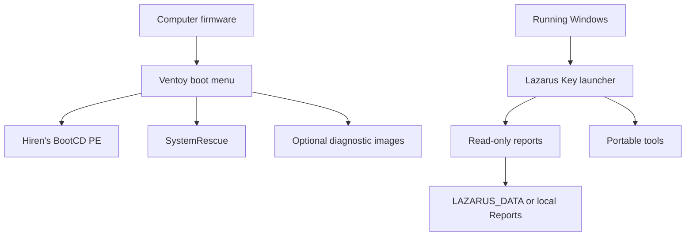

# Architecture

## Design goals

Lazarus Key is optimized for a nominal 8 GB flash drive and for technicians who need a small, understandable toolkit rather than a giant collection of overlapping images.

The design prioritizes:

1. Broad Windows and Linux repair coverage with two core images.
2. Read-only diagnostics before mutation.
3. Clear separation between boot environments, technician utilities, and collected data.
4. Reproducibility through manifests, hashes, validation, and source-controlled configuration.
5. Safe public distribution without repackaging third-party binaries.

## Component flow

## Trust boundaries

| Boundary | Project behavior |
| --- | --- |
| Firmware to Ventoy | Ventoy handles legacy BIOS and UEFI booting. Secure Boot behavior depends on firmware and Ventoy enrollment. |
| Ventoy to ISO | ISO files are independently downloaded and verified against pinned SHA-256 hashes. |
| Launcher to Windows | The launcher invokes Windows management consoles and read-only PowerShell collection. |
| Reports to storage | Reports may contain sensitive device and network details and are excluded from source control. |
| Third-party tools | Their behavior, licensing, and updates remain the responsibility of their publishers and the technician. |

## Update strategy

- Update one ISO at a time.
- Record the upstream version, size, official URL, and SHA-256 in the manifest.
- Update any Ventoy menu aliases that contain versioned filenames.
- Run project validation.
- Re-run the physical test matrix before publishing a release.

## Why two primary ISOs

Hiren's BootCD PE provides a familiar Windows graphical environment. SystemRescue supplies current Linux filesystem, storage, networking, imaging, and memory tools. Together they cover the main rescue cases while leaving usable space on an 8 GB drive.
